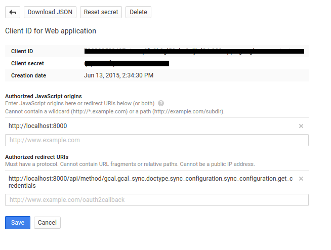
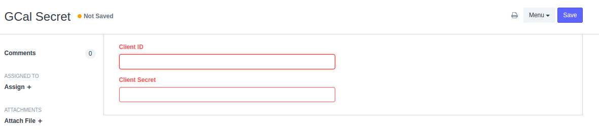
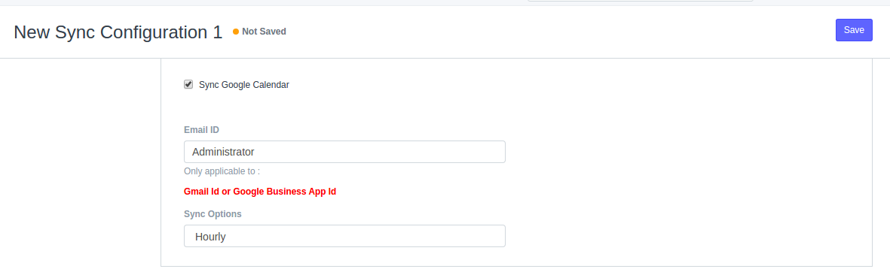

###Introduction:

Google Calendar Sync 
Features:

1. User will be able to sync google's primary calendar of selected account.
2. User can create and updates the records, from google to erp and Vice Versa.

###Depends on
- frappe (To install: [bench page](https://github.com/frappe/bench) )
- python module: oauth2client, gdata, google-api-python-client, keyring

###Installation
Note: Compatible with frappe 5 and above.

1. bench get-app gcal [https://github.com/indictranstech/GCAL.git](https://github.com/indictranstech/GCAL.git)
2. bench install-app gcal or install from frappe desk installer.
3. bench migrate

###Configuration Steps

####Enable the Google Calendar API

<b>Set redirect uri as,</b> `{Your Server Url}/api/method/gcal.gcal_sync.doctype.sync_configuration.sync_configuration.get_credentials`  
<b>JavaScript origins : </b> `{Your Server Url}`

More on google developer console, [Google Developer Console](https://developers.google.com/console/help/new/)

####Setup Google Calendar API credentials
  <b> Goto GCal Sync > GCal Secret : </b>  Set Client Id and Client Secret

####Setup individual profile
 
1. Login with own frappe user credentials
2. Goto, Gcal Sync > Sync Configuration List > Create New Record.

